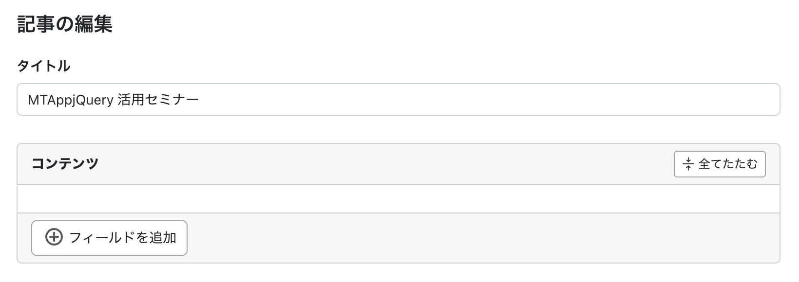

[セミナー資料一覧](https://github.com/bit-part/seminar/blob/main/README.md) / 2024-01-18

# MTAppjQuery でこう変わる！MT8 の管理画面をより使いやすくする実践レシピ - MTAppjQuery v3 最新版

2024年 1月18日（木）オンラインミニセミナー

MT8 の管理画面をより使いやすく最適化するポイント

## リンク集

- マニュアル等
  - [MTAppjQuery ドキュメント \| MTAppjQuery サポートサイト](https://support.bit-part.net/mtappjquery)
  - [MTAppjQuery v3 ユーザーマニュアル \| MTAppjQuery サポートサイト](https://support.bit-part.net/mtappjquery/v3/usage)
    - [インストール方法](https://support.bit-part.net/mtappjquery/v3/usage/35830)
    - [MTAppjQuery v2 から v3 へのアップグレード](https://support.bit-part.net/mtappjquery/v3/usage/64123)
  - [逆引き辞典 \| MTAppjQuery サポートサイト](https://support.bit-part.net/mtappjquery/v3/tips)
  - [Movable Type Data API v6](https://movabletype.github.io/mt-docs-data-api-reference/v6.html)
  - [TinyMCE 6 Documentation \| TinyMCE Documentation](https://www.tiny.cloud/docs/tinymce/latest/)
- ご購入関係
  - [bit part 合同会社 ショップ](https://bitpart.thebase.in/)
  - [MTAppjQuery\+MTライセンスパック \| 3rd Focus](https://3rdfocus.jp/eshop/items/APLP0001/)
  - [Movable Type SmartSync Pack \| 3rd Focus](https://3rdfocus.jp/eshop/items/COLS0003/)
  - [Movable Type SmartSync Pack \(MTライセンス無し\) \| 3rd Focus](https://3rdfocus.jp/eshop/items/COLS0006/)
  - [エンタープライズに最適な高機能CMS Movable Type Premium](https://www.sixapart.jp/movabletype/solutions/mtpremium.html)

## レシピ：すっきり幅広入力欄


## レシピ：書き易い順に並び替えた入力画面


### user.js

```javascript
(function($){

    if (mtappVars.screen_id === 'edit-entry') {

        // ドラッグ・アンド・ドロップによる並べ替えを無効化
        mtapp.sortDisabled();

        // フィールドの並べ替え
        mtapp.fieldSort({
            sort: 'title,excerpt,keywords,tags,text',
            otherFieldHide: true
        });

        // フィールドをカスタマイズ
        mtapp.customize({
            basename: 'excerpt',
            label: 'リード',
            hint: '一覧画面と詳細画面の上部の囲みの中に表示されます'
        });
        mtapp.customize({
            basename: 'keywords',
            label: '関連記事キーワード',
            hint: '関連記事を表示する際に利用されます'
        });

        // 表示オプションを非表示
        $('#display-options').hide();

        // 本文欄の上に少し余白を追加
        $('#text-field').addClass('mt-4');

        // 「本文・続き」のタブや「フォーマット」を非表示
        $('#editor-header').hide();
    }

})(jQuery);
```

## レシピ：入力タイプによる編集画面切り替え


### user.js

```javascript
(function($){
    if (mtappVars?.contentType?.name === 'お知らせ') {

        document.body.setAttribute('data-content-type', mtappVars.contentType.name);
        
        mtapp.modalMsg({
            type: 'info',
            title: '入力タイプを選択してください',
            content: `
                <div class="d-inline-flex gap-3">
                    <button type="button" class="btn btn-default" data-entry-type="release" data-bs-dismiss="modal">ニュースリリース</button>
                    <button type="button" class="btn btn-default" data-entry-type="info" data-bs-dismiss="modal">お知らせ</button>
                    <button type="button" class="btn btn-default" data-entry-type="docs" data-bs-dismiss="modal">資料リンク</button>
                </div>
            `,
            callbacks: [
                {
                    type: 'shown.bs.modal',
                    action: function () {
                        const buttons = document.querySelectorAll('[data-entry-type]');
                        buttons.forEach(function (button) {
                            button.addEventListener('click', function () {
                                const type = this.getAttribute('data-entry-type');
                                document.body.setAttribute('data-entry-type', type);
                            });
                        });
                    }
                }
            ]
        });

    }
})(jQuery);
```

### user.css

```css
/* タイトルフィールド以外を非表示 */
body[data-content-type="お知らせ"] [data-mtapp-field-label] {
    display: none;
}
body[data-content-type="お知らせ"] [data-mtapp-field-label="タイトル"] {
    display: block;
}
/* data-entry-type="release" */
body[data-content-type="お知らせ"][data-entry-type="release"] #page-title:after {
    content: '（ニュースリリース）';
    font-size: 0.8em;
}
body[data-content-type="お知らせ"][data-entry-type="release"] [data-mtapp-field-label="本文"],
body[data-content-type="お知らせ"][data-entry-type="release"] [data-mtapp-field-label="お問い合わせ先"] {
    display: block;
}
/* data-entry-type="info" */
body[data-content-type="お知らせ"][data-entry-type="info"] #page-title:after {
    content: '（お知らせ）';
    font-size: 0.8em;
}
body[data-content-type="お知らせ"][data-entry-type="info"] [data-mtapp-field-label="概要"],
body[data-content-type="お知らせ"][data-entry-type="info"] [data-mtapp-field-label="本文"],
body[data-content-type="お知らせ"][data-entry-type="info"] [data-mtapp-field-label="og:image"],
body[data-content-type="お知らせ"][data-entry-type="info"] [data-mtapp-field-label="タグ"],
body[data-content-type="お知らせ"][data-entry-type="info"] [data-mtapp-field-label="カテゴリ"] {
    display: block;
}
/* data-entry-type="docs" */
body[data-content-type="お知らせ"][data-entry-type="docs"] #page-title:after {
    content: '（資料リンク）';
    font-size: 0.8em;
}
body[data-content-type="お知らせ"][data-entry-type="docs"] [data-mtapp-field-label="ファイル"] {
    display: block;
}
```

## レシピ：記事に「コンテンツ」フィールドを作成



### user.js

```javascript
(function($){

    if (mtappVars.screen_id === 'edit-entry') {

        // ドラッグ・アンド・ドロップによる並べ替えを無効化
        mtapp.sortDisabled();
        const displayOptions = document.getElementById('display-options');
        if (displayOptions) {
            displayOptions.style.display = 'none';
        }
        // $('#display-options').hide();
        

        // フィールドの並べ替え
        mtapp.fieldSort({
            sort: 'title,customfield_blog_content',
            otherFieldHide: true
        });

        // マルチフィールドを適用
        mtapp.multiField({
            version: 3,
            id: 'customfield_blog_content',
            label: 'コンテンツ'
        });
    }

})(jQuery);
```

### トッピング：自分好みの入力フィールドを定義


### user.js

```javascript
(function($){

    if (mtappVars.screen_id === 'edit-entry') {

        // ドラッグ・アンド・ドロップによる並べ替えを無効化
        mtapp.sortDisabled();
        const displayOptions = document.getElementById('display-options');
        if (displayOptions) {
            displayOptions.style.display = 'none';
        }
        // $('#display-options').hide();


        // フィールドの並べ替え
        mtapp.fieldSort({
            sort: 'title,customfield_blog_content',
            otherFieldHide: true
        });

        // マルチフィールドを適用
        mtapp.multiField({
            version: 3,
            id: 'customfield_blog_content',
            label: 'コンテンツ',
            fieldBlocks: {
                headingText: {type: 'text', label: '見出しテキスト', data: ''},
                headingLevel: {
                    type: 'select', label: 'レベル', data: 'h2', options: [
                        {label: 'h2', data: 'h2'},
                        {label: 'h3', data: 'h3'},
                        {label: 'h4', data: 'h4'},
                    ]
                },
                headingAnchor: {type: 'text', label: 'アンカー', data: ''},
                heading: {
                    type: 'multi-column',
                    label: '見出し',
                    data: {},
                    columns: [
                        { col: 8, fields: ['headingText'] },
                        { col: 2, fields: ['headingLevel'] },
                        { col: 2, fields: ['headingAnchor'] },
                    ]
                },
                bodyText: {type: 'tinymce', label: '文章', data: '', preset: 'simple'},
                bodyImage: {
                    type: 'image',
                    label: '画像',
                    textFieldLabel: 'altテキスト',
                    data: {id: '', url: '', thumbnail: '', alt: ''}
                },
                bodyImagePosition: {
                    type: 'radio', label: '画像位置', data: 'left', options: [
                        {label: '左', data: 'left'},
                        {label: '中央', data: 'center'},
                        {label: '右', data: 'right'},
                    ]
                },
                body: {
                    type: 'multipurpose',
                    label: '本文',
                    innerGroups: [
                        {
                            handle: 'bodyText',
                            hasBorder: false,
                            fixed: true,
                            fields: ['bodyText'],
                        },
                        {
                            handle: 'bodyImage',
                            hasBorder: false,
                            fixed: true,
                            fields: ['bodyImage', 'bodyImagePosition'],
                        },
                    ],
                    data: {}
                },
                gallery: {
                    type: 'multipurpose',
                    label: '画像ギャラリー',
                    innerGroups: [
                        {
                            handle: 'images',
                            hasBorder: false,
                            fixed: false,
                            fields: ['bodyImage'],
                        },
                    ],
                    data: {}
                },
            },
            fieldGroups: [
                [
                    'heading', 'body', 'gallery'
                ]
            ]
        });
    }

})(jQuery);
```

### スライドエディタ

**MT標準のボタンを利用**


```javascript
bodyText: {type: 'tinymce', label: '文章', data: ''},
```

**プリセット（simple）**


```javascript
bodyText: {type: 'tinymce', label: '文章', data: '', preset: 'simple'},
```

**TinyMCE 6 のオプション（preset の simple に table を追加）**


```javascript
bodyText: {type: 'tinymce', label: '文章', data: '', options: {
    plugins: 'link lists table',
    menubar: false,
    language: 'ja',
    toolbar: 'bold link numlist bullist | table tabledelete | tableprops tablerowprops tablecellprops | tableinsertrowbefore tableinsertrowafter tabledeleterow | tableinsertcolbefore tableinsertcolafter tabledeletecol'
}},
```

### トッピング：コンテンツデータとの連携


### user.js

```javascript
(function($){

    if (mtappVars.screen_id === 'edit-entry') {

        // ドラッグ・アンド・ドロップによる並べ替えを無効化
        mtapp.sortDisabled();
        const displayOptions = document.getElementById('display-options');
        if (displayOptions) {
            displayOptions.style.display = 'none';
        }
        // $('#display-options').hide();


        // フィールドの並べ替え
        mtapp.fieldSort({
            sort: 'title,customfield_blog_content',
            otherFieldHide: true
        });

        // マルチフィールドを適用
        mtapp.multiField({
            version: 3,
            id: 'customfield_blog_content',
            label: 'コンテンツ',
            fieldBlocks: {
                headingText: {type: 'text', label: '見出しテキスト', data: ''},
                headingLevel: {
                    type: 'select', label: 'レベル', data: 'h2', options: [
                        {label: 'h2', data: 'h2'},
                        {label: 'h3', data: 'h3'},
                        {label: 'h4', data: 'h4'},
                    ]
                },
                headingAnchor: {type: 'text', label: 'アンカー', data: ''},
                heading: {
                    type: 'multi-column',
                    label: '見出し',
                    data: {},
                    columns: [
                        { col: 8, fields: ['headingText'] },
                        { col: 2, fields: ['headingLevel'] },
                        { col: 2, fields: ['headingAnchor'] },
                    ]
                },
                bodyText: {type: 'tinymce', label: '文章', data: '', preset: 'simple'},
                bodyImage: {
                    type: 'image',
                    label: '画像',
                    textFieldLabel: 'altテキスト',
                    data: {id: '', url: '', thumbnail: '', alt: ''}
                },
                bodyImagePosition: {
                    type: 'radio', label: '画像位置', data: 'left', options: [
                        {label: '左', data: 'left'},
                        {label: '中央', data: 'center'},
                        {label: '右', data: 'right'},
                    ]
                },
                body: {
                    type: 'multipurpose',
                    label: '本文',
                    innerGroups: [
                        {
                            handle: 'bodyText',
                            hasBorder: false,
                            fixed: true,
                            fields: ['bodyText'],
                        },
                        {
                            handle: 'bodyImage',
                            hasBorder: false,
                            fixed: true,
                            fields: ['bodyImage', 'bodyImagePosition'],
                        },
                    ],
                    data: {}
                },
                gallery: {
                    type: 'multipurpose',
                    label: '画像ギャラリー',
                    innerGroups: [
                        {
                            handle: 'images',
                            hasBorder: false,
                            fixed: false,
                            fields: ['bodyImage'],
                        },
                    ],
                    data: {}
                },
                product: {
                    type: 'contentData',
                    label: '製品',
                    siteId: mtappVars.blog_id,
                    contentTypeId: mtappVars.contentTypes.find(
                        (contentType) => contentType.name === '製品' && contentType.site_id === mtappVars.blog_id
                    ).id,
                    radio: false,
                    modalEdit: true,
                    modalCreate: true,
                    dataLabelName: '製品名',
                    data: []
                }
            },
            fieldGroups: [
                [
                    'heading', 'body', 'gallery', 'product'
                ]
            ]
        });
    }

})(jQuery);
```

### トッピング：コンディショナルフィールド

- 「本文」フィールドブロックに「画像あり・なし」ラジオボタンを追加 
- 「画像あり」のときだけ「画像」ブロックを表示

**user.js**

```javascript
(function($){

    if (mtappVars.screen_id === 'edit-entry') {

        // ドラッグ・アンド・ドロップによる並べ替えを無効化
        mtapp.sortDisabled();
        const displayOptions = document.getElementById('display-options');
        if (displayOptions) {
            displayOptions.style.display = 'none';
        }
        // $('#display-options').hide();


        // フィールドの並べ替え
        mtapp.fieldSort({
            sort: 'title,customfield_blog_content',
            otherFieldHide: true
        });

        // マルチフィールドを適用
        mtapp.multiField({
            version: 3,
            id: 'customfield_blog_content',
            label: 'コンテンツ',
            fieldBlocks: {
                headingText: {type: 'text', label: '見出しテキスト', data: ''},
                headingLevel: {
                    type: 'select', label: 'レベル', data: 'h2', options: [
                        {label: 'h2', data: 'h2'},
                        {label: 'h3', data: 'h3'},
                        {label: 'h4', data: 'h4'},
                    ]
                },
                headingAnchor: {type: 'text', label: 'アンカー', data: ''},
                heading: {
                    type: 'multi-column',
                    label: '見出し',
                    data: {},
                    columns: [
                        { col: 8, fields: ['headingText'] },
                        { col: 2, fields: ['headingLevel'] },
                        { col: 2, fields: ['headingAnchor'] },
                    ]
                },
                bodyText: {type: 'tinymce', label: '文章', data: '', preset: 'simple'},
                bodyImage: {
                    type: 'image',
                    label: '画像',
                    textFieldLabel: 'altテキスト',
                    data: {id: '', url: '', thumbnail: '', alt: ''}
                },
                bodyImagePosition: {
                    type: 'radio', label: '画像位置', data: 'left', options: [
                        {label: '左', data: 'left'},
                        {label: '中央', data: 'center'},
                        {label: '右', data: 'right'},
                    ]
                },
                bodyHasImage: {
                    type: 'radio', 
                    label: '画像の有無', 
                    data: 1, 
                    options: [
                        { label: '画像あり', data: 1 },
                        { label: '画像なし', data: 0 }
                    ]
                },
                body: {
                    type: 'multipurpose',
                    label: '本文',
                    innerGroups: [
                        {
                            handle: 'bodyType',
                            hasBorder: false,
                            fixed: true,
                            fields: ['bodyHasImage'],
                        },
                        {
                            handle: 'bodyText',
                            hasBorder: false,
                            fixed: true,
                            fields: ['bodyText'],
                        },
                        {
                            handle: 'bodyImage',
                            hasBorder: false,
                            fixed: true,
                            fields: ['bodyImage', 'bodyImagePosition'],
                            condition: [
                                {
                                    groupHandle: 'bodyType',
                                    fieldHandle: 'bodyHasImage',
                                    fieldValue: 1
                                },
                            ]
                        },
                    ],
                    data: {}
                },
                gallery: {
                    type: 'multipurpose',
                    label: '画像ギャラリー',
                    innerGroups: [
                        {
                            handle: 'images',
                            hasBorder: false,
                            fixed: false,
                            fields: ['bodyImage'],
                        },
                    ],
                    data: {}
                },
                product: {
                    type: 'contentData',
                    label: '製品',
                    siteId: mtappVars.blog_id,
                    contentTypeId: mtappVars.contentTypes.find(
                        (contentType) => contentType.name === '製品' && contentType.site_id === mtappVars.blog_id
                    ).id,
                    radio: false,
                    modalEdit: true,
                    modalCreate: true,
                    dataLabelName: '製品名',
                    data: []
                }
            },
            fieldGroups: [
                [
                    'heading', 'body', 'gallery', 'product'
                ]
            ]
        });
    }

})(jQuery);
```

**user.js（リンクフィールドを追加）**

```javascript
(function($){

    if (mtappVars.screen_id === 'edit-entry') {

        // ドラッグ・アンド・ドロップによる並べ替えを無効化
        mtapp.sortDisabled();
        const displayOptions = document.getElementById('display-options');
        if (displayOptions) {
            displayOptions.style.display = 'none';
        }
        // $('#display-options').hide();


        // フィールドの並べ替え
        mtapp.fieldSort({
            sort: 'title,customfield_blog_content',
            otherFieldHide: true
        });

        // マルチフィールドを適用
        mtapp.multiField({
            version: 3,
            id: 'customfield_blog_content',
            label: 'コンテンツ',
            fieldBlocks: {
                headingText: {type: 'text', label: '見出しテキスト', data: ''},
                headingLevel: {
                    type: 'select', label: 'レベル', data: 'h2', options: [
                        {label: 'h2', data: 'h2'},
                        {label: 'h3', data: 'h3'},
                        {label: 'h4', data: 'h4'},
                    ]
                },
                headingAnchor: {type: 'text', label: 'アンカー', data: ''},
                heading: {
                    type: 'multi-column',
                    label: '見出し',
                    data: {},
                    columns: [
                        { col: 8, fields: ['headingText'] },
                        { col: 2, fields: ['headingLevel'] },
                        { col: 2, fields: ['headingAnchor'] },
                    ]
                },
                bodyText: {type: 'tinymce', label: '文章', data: '', preset: 'simple'},
                bodyImage: {
                    type: 'image',
                    label: '画像',
                    textFieldLabel: 'altテキスト',
                    data: {id: '', url: '', thumbnail: '', alt: ''}
                },
                bodyImagePosition: {
                    type: 'radio', label: '画像位置', data: 'left', options: [
                        {label: '左', data: 'left'},
                        {label: '中央', data: 'center'},
                        {label: '右', data: 'right'},
                    ]
                },
                bodyHasImage: {
                    type: 'radio', 
                    label: '画像の有無', 
                    data: 1, 
                    options: [
                        { label: '画像あり', data: 1 },
                        { label: '画像なし', data: 0 }
                    ]
                },
                body: {
                    type: 'multipurpose',
                    label: '本文',
                    innerGroups: [
                        {
                            handle: 'bodyType',
                            hasBorder: false,
                            fixed: true,
                            fields: ['bodyHasImage'],
                        },
                        {
                            handle: 'bodyText',
                            hasBorder: false,
                            fixed: true,
                            fields: ['bodyText'],
                        },
                        {
                            handle: 'bodyImage',
                            hasBorder: false,
                            fixed: true,
                            fields: ['bodyImage', 'bodyImagePosition'],
                            condition: [
                                {
                                    groupHandle: 'bodyType',
                                    fieldHandle: 'bodyHasImage',
                                    fieldValue: 1
                                },
                            ]
                        },
                    ],
                    data: {}
                },
                gallery: {
                    type: 'multipurpose',
                    label: '画像ギャラリー',
                    innerGroups: [
                        {
                            handle: 'images',
                            hasBorder: false,
                            fixed: false,
                            fields: ['bodyImage'],
                        },
                    ],
                    data: {}
                },
                product: {
                    type: 'contentData',
                    label: '製品',
                    siteId: mtappVars.blog_id,
                    contentTypeId: mtappVars.contentTypes.find(
                        (contentType) => contentType.name === '製品' && contentType.site_id === mtappVars.blog_id
                    ).id,
                    radio: false,
                    modalEdit: true,
                    modalCreate: true,
                    dataLabelName: '製品名',
                    data: []
                },
                linkTitle: {type: 'text', label: 'リンクタイトル', data: ''},
                linkType: {
                    type: 'radio', label: 'リンクの種類', data: 'url', options: [
                        {label: 'URL', data: 'url'},
                        {label: 'ファイル', data: 'file'},
                    ]
                },
                linkUrl: {type: 'url', label: 'URL', data: ''},
                linkFile: {
                    type: 'asset',
                    label: 'ファイル',
                    data: {id: '', url: '', alt: ''}
                },
                link: {
                    type: 'multipurpose',
                    label: 'リンク',
                    innerGroups: [
                        {
                            handle: 'title',
                            hasBorder: false,
                            fixed: true,
                            fields: ['linkTitle'],
                        },
                        {
                            handle: 'type',
                            hasBorder: false,
                            fixed: true,
                            fields: ['linkType'],
                        },
                        {
                            handle: 'url',
                            hasBorder: false,
                            fixed: true,
                            fields: ['linkUrl'],
                            condition: [
                                {
                                    groupHandle: 'type',
                                    fieldHandle: 'linkType',
                                    fieldValue: 'url'
                                },
                            ]
                        },
                        {
                            handle: 'file',
                            hasBorder: false,
                            fixed: true,
                            fields: ['linkFile'],
                            condition: [
                                {
                                    groupHandle: 'type',
                                    fieldHandle: 'linkType',
                                    fieldValue: 'file'
                                },
                            ]
                        },
                        {
                            handle: 'url',
                            hasBorder: false,
                            fixed: true,
                            fields: ['linkUrl'],
                            condition: [
                                {
                                    groupHandle: 'type',
                                    fieldHandle: 'linkType',
                                    fieldValue: 'url'
                                },
                                {
                                    groupHandle: 'type',
                                    fieldHandle: 'linkType',
                                    fieldValue: 'file'
                                },
                            ]
                        },
                    ],
                    data: {}
                },
            },
            fieldGroups: [
                [
                    'heading', 'body', 'gallery', 'product', 'link'
                ]
            ]
        });
    }

})(jQuery);
```

